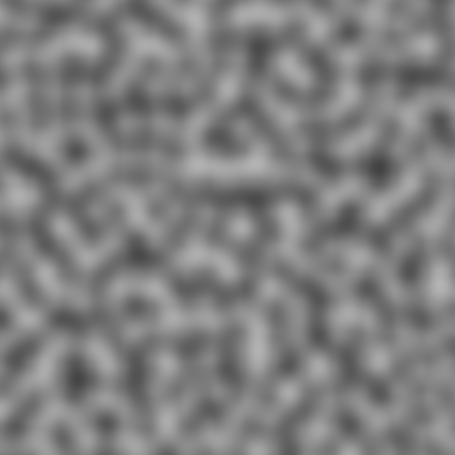

#### What is this?

Library to generate textures of noises and a visualization app.

Main reason for this repository existing is for me to fully understand and implement my version of Perlin noise

I would like to focus on performance as well as clarity. When choosing between insignificant performance boost and loss of clarity I will choose clarity

[Try this online!](https://bukreev.org/other/noises/noises.html)

#### Build instructions

./release.sh and ./debug.sh for native release and debug builds respectively.

./web_build.sh for a web export via emscripten.

